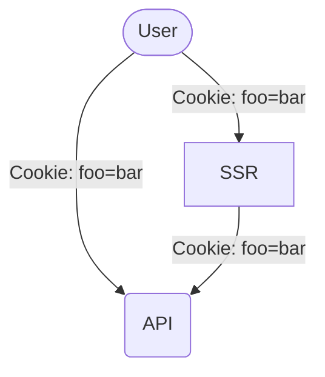

This is a [Next.js](https://nextjs.org/) project bootstrapped with [`create-next-app`](https://github.com/vercel/next.js/tree/canary/packages/create-next-app).

## What is this?

This project is a sandbox to demonstrate how to customize request headers in
SSR api calls.

The premise is that you need to add some authentication headers to your
outgoing API calls, and you need some information from the original request to
build the necessary headers.



With this example, you can write a `prepareHeaders` function, where you can
- Do nothing if running on browser
- Read cookies or other stuff from request
- Prepare new cookies to use on the axios request

All this logic can be kept in one place, so your actual RTK use remains clean:

createApi endpoint:
```ts
getTodos: builder.query<Todo[], void>({
  query: (): AxiosBaseQueryArgs => ({ url: 'todos/', method: 'get' }),
  providesTags: ['Todos'],
}),
```

Page component:
```ts
const { data } = useGetTodosQuery();
```

getServersideProps:
```ts
store.dispatch(getTodos.initiate());
await Promise.all(getRunningOperationPromises());
```

## Running

To run the development server:

```bash
nvm use
npm run dev
```

Open [http://localhost:3505](http://localhost:3505) with your browser to see the result.

## Learn More

Technologies used:

- [Next.js](https://nextjs.org/)
- [Redux](https://redux.js.org/)
- [RTK Query](https://redux-toolkit.js.org/rtk-query/overview)
- [Axios](https://axios-http.com/)
- [{JSON} Placeholder](https://jsonplaceholder.typicode.com/)
